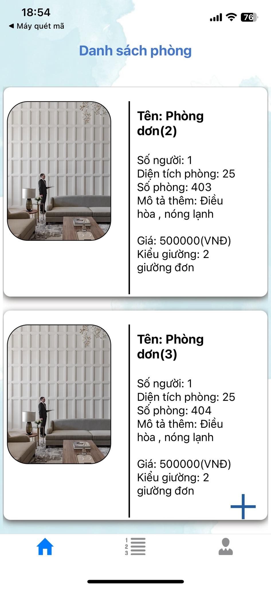
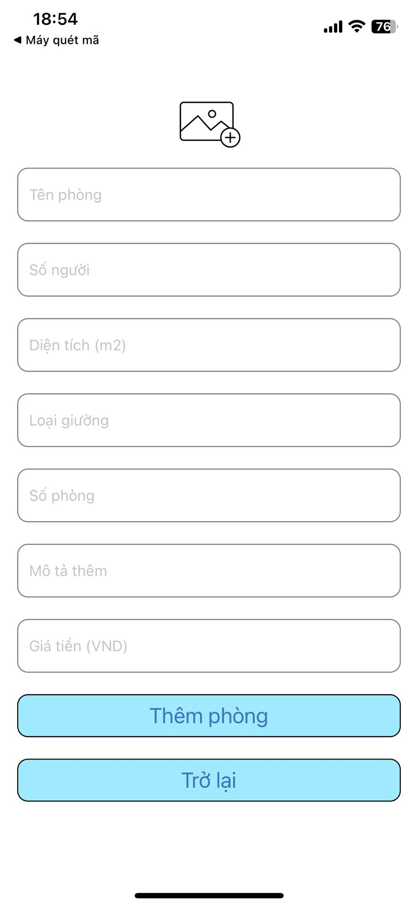
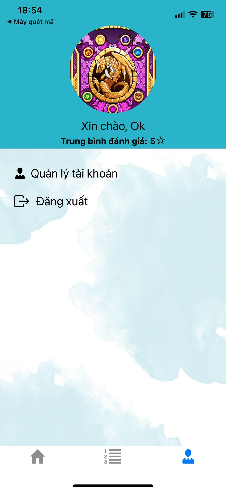
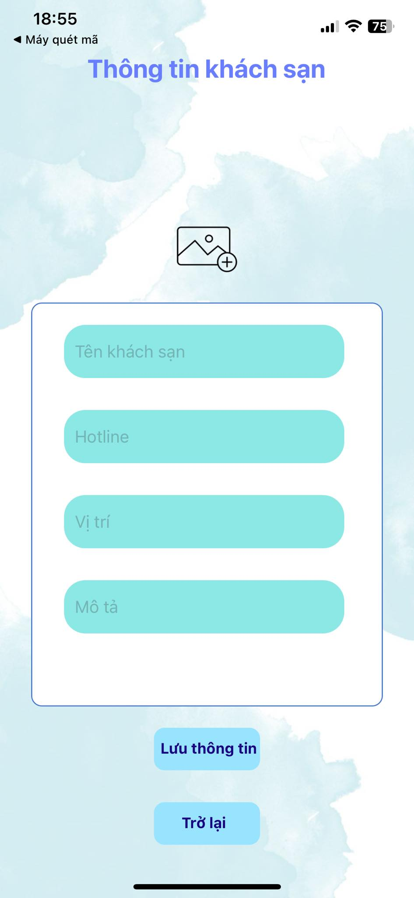
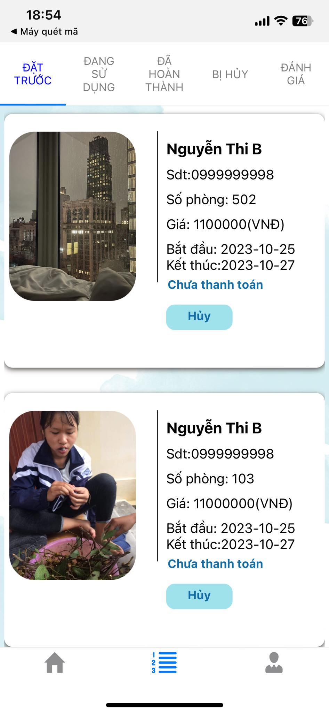
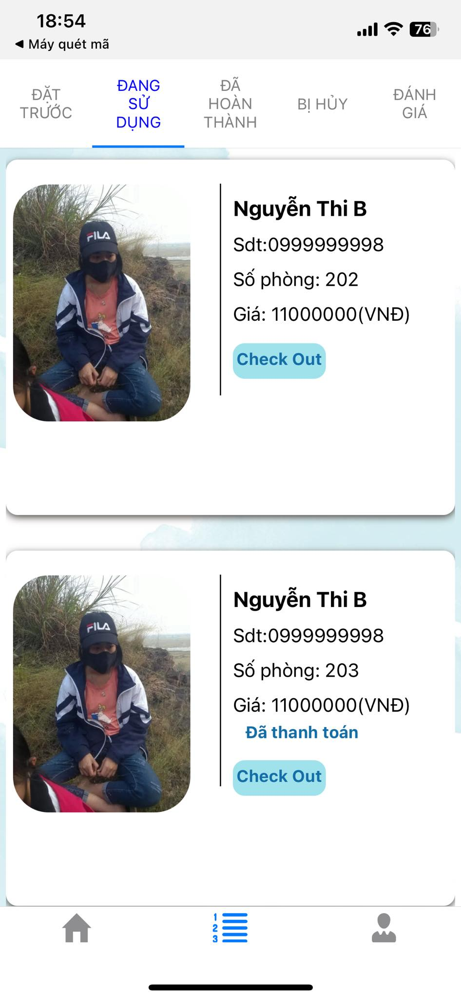
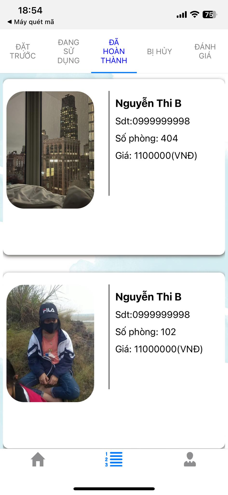
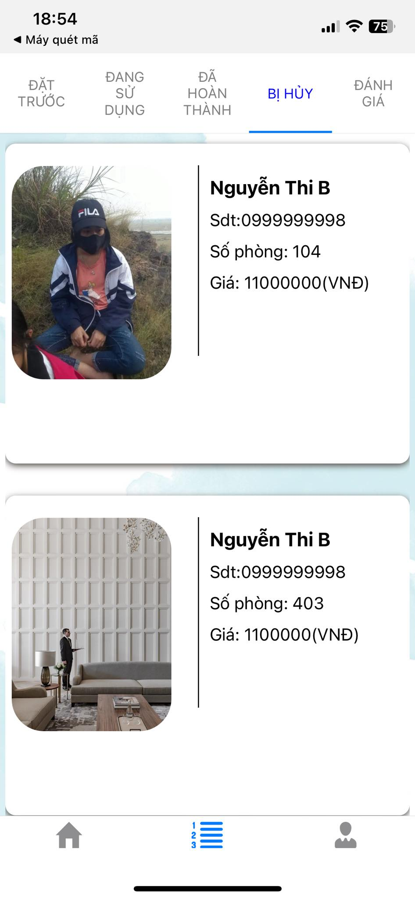
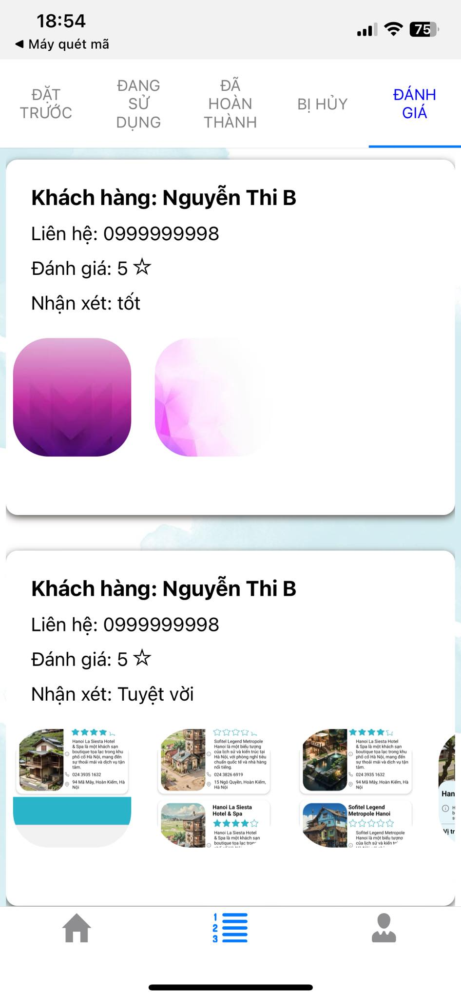

**App đặt phòng RESERVAR**

**Hướng dẫn**
1. BE
- Sửa kết nối database và ip_address trong của máy trong file application.properties
2. Thông tin tài khoản test thanh toán VNP
- Ngân hàng:	NCB
- Số thẻ:	9704198526191432198
- Tên chủ thẻ:	NGUYEN VAN A
- Ngày phát hành:	07/15
- Mật khẩu OTP:	123456

**PartnerFE(App đối tác)**

**Phần A**
1. Sau khi đăng nhập hoặc đăng ký thì sẽ hiện ra màn hình danh sách phòng đươc đối tác thêm vào(Bấm trực tiếp vào phòng để có thể sửa thông tin phòng)

2. Bấm vào '+' ở góc dưới của màn hình để thực hiện thêm phòng:

3. Bấm vào 'Quản lý tài khoản' để xem hoặc sửa thông tin khách sạn

4. Bấm vào sửa thông tin để thêm hoặc sửa thông tin của khách sạn,sau khi sửa thông tin xong bấm ' Lưu thông tin' để trở về màn hình danh sách phòng.

**Phần B**
1. Những phòng được khách đặt trước sẽ hiện dưới dạng danh sách,các phòng được đặt trước sẽ không hiển thị ra ở phần tìm phòng của khách hàng, nếu khách hàng đã thanh toán thì sẽ hiện ra nút 'CheckIn', khách chưa thanh toán thì hiện ra nút hủy:

2. Sau khi bấm CheckIn, phòng sẽ được chuyển sang trạng thái "Đang sử dụng":

3. Sau khi hết thời gian đặt phòng hoặc khách muốn kết thúc đặt thì sẽ bấm nút 'CheckOut' để chuyển sang trạng thái "đã hoàn thành" đặt.

4. Các phòng bị hủy sẽ được hiện ra trong màn hình này:

5. Màn hình đánh giá của khách hàng:

